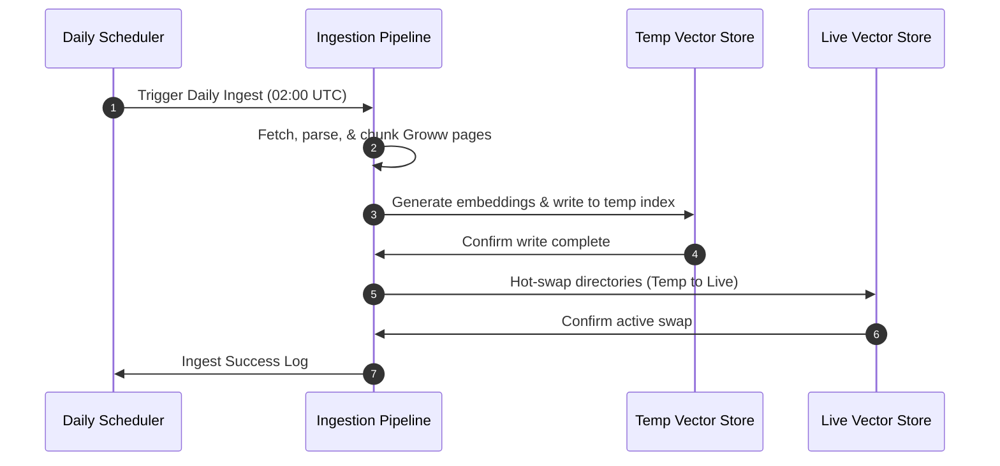
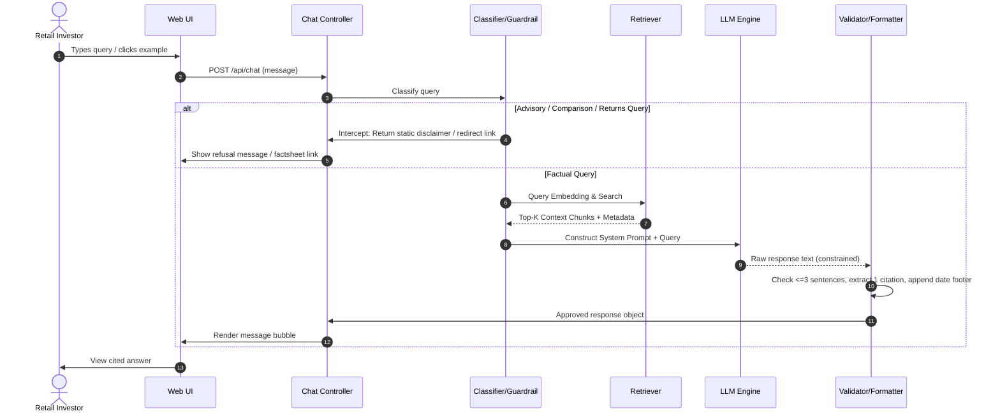

# Architecture Specification — Groww Genie
## Retrieval-Augmented Generation (RAG) System Architecture

This document describes the comprehensive system architecture for the facts-only, RAG-based Q&A chatbot called **Groww Genie**. The system is scoped to five **Nippon India Mutual Fund** schemes using a curated corpus of 25 verified official URLs, and is derived from the requirements defined in [problemStatement.md](file:///c:/Users/Juily/Desktop/Sayali%20Projects/Milestone_Chatbot/docs/problemStatement.md).

---

## 1. Design Goals

| Goal | Architectural Implication |
| :--- | :--- |
| **Facts-only answers** | Retrieval is strictly grounded in the vector corpus; LLM is constrained by system prompts and post-generation output validation. |
| **Source-backed responses** | Every answer carries exactly one citation URL from the active corpus. |
| **Compliance** | Advisory/comparison/returns queries are classified and refused/redirected before or instead of RAG retrieval. |
| **Accuracy over intelligence** | Prefer retrieved text over model inference; a narrow corpus of 5 scheme pages reduces hallucination risk. |
| **Transparency** | Fixed response format: $\le 3$ sentences + citation link + `"Last updated from sources: <date>"` footer. |
| **Privacy** | Stateless chat transactions; no PII collection or persistence. |

---

## 2. High-Level Architecture

The system is partitioned into two execution domains:
1. **Offline Ingestion Pipeline:** Runs on a daily schedule to scrape the 5 Groww URLs, parse them into sections, chunk, embed, and refresh the local vector store.
2. **Online Query Pipeline:** Operates in real-time, executing query classification, context-aware vector retrieval, LLM-based generation, safety validation, and formatting.

```mermaid
flowchart TD
    %% Styling
    classDef layer fill:#f8fafc,stroke:#3b82f6,stroke-width:2px;
    classDef database fill:#ecfdf5,stroke:#10b981,stroke-width:2px;
    classDef gate fill:#fef2f2,stroke:#ef4444,stroke-width:2px;

    subgraph Presentation ["Presentation Layer"]
        UI[Web UI / Chat Interface + Disclaimer]
    end

    subgraph Application ["Application Layer"]
        Controller[Chat Controller]
        Classifier{Query Classifier}
        Refusal[Refusal / Redirect Handler]
        RAG[RAG Orchestrator]
        Formatter[Response Formatter]
    end

    subgraph Retrieval ["Retrieval & Storage Layer"]
        DB[(Vector Store / Metadata Store)]
        Retriever[Query Retriever]
    end

    subgraph Generation ["Generation Layer"]
        LLM[LLM Engine]
        Validator[Output Validator]
    end

    subgraph Ingestion ["Ingestion Layer (Offline)"]
        Scheduler[Daily Scheduler]
        Crawler[Page Crawler]
        Parser[Section Parser]
        Embed[Embedding Service]
    end

    %% Flows
    UI -->|1. User Message| Controller
    Controller -->|2. Route| Classifier
    Classifier -->|Advisory / Returns| Refusal
    Classifier -->|Factual Query| RAG
    
    RAG -->|3. Embed Query| Retriever
    DB -.->|Read Context| Retriever
    Retriever -->|4. Top-K Chunks| RAG
    
    RAG -->|5. Build Prompt| LLM
    LLM -->|6. Raw Text| Validator
    Validator -->|7. Approved Text| Formatter
    Formatter -->|8. Cited Response| Controller
    Controller -->|9. Structured JSON| UI
    
    Scheduler -->|Trigger (Daily)| Crawler
    Crawler --> Parser --> Embed -->|Upsert Chunks| DB

    %% Apply Classes
    class Presentation,Application,Generation,Ingestion layer;
    class DB database;
    class Classifier,Refusal gate;
```

---

## 3. System Components

### 3.1. Presentation Layer (Minimal UI)
A single-page, responsive web chat interface.
* **Responsibilities:**
  * Display welcoming banner and persistent disclaimer: **"Facts-only. No investment advice."**
  * Present 3 clickable example questions (Large Cap, Flexi Cap, and Statement download).
  * Render chat bubbles with clickable citations and date freshness footers.
  * Enforce safety by never prompting for, storing, or transmitting PII.
* **Suggested Example Questions:**
  1. *What is the expense ratio of Nippon India Large Cap Fund (Direct - Growth)?*
  2. *What are the exit load details for Nippon India Flexi Cap Fund (Direct - Growth)?*
  3. *How can I download my capital gains statement?*

### 3.2. Application Layer

#### Chat Controller
Exposes a stateless endpoint `POST /api/chat` accepting `{ "message": string }`. It maintains no cookies or tracking identifiers. It returns a structured JSON:
```json
{
  "answer": "The expense ratio of Nippon India Large Cap Fund (Direct - Growth) is 0.58%.",
  "citation_url": "https://groww.in/mutual-funds/nippon-india-large-cap-fund-direct-growth",
  "last_updated": "June 1, 2026",
  "is_refusal": false
}
```

#### Query Classifier
Evaluates the query prior to database retrieval to enforce strict compliance:

| Class | Examples | Action |
| :--- | :--- | :--- |
| **Factual** | *"Exit load of Small Cap?"*, *"Expense ratio?"*, *"Who manages Flexi Cap?"* | Proceed to RAG Retriever. |
| **Advisory** | *"Should I invest in Large Cap?"*, *"Which scheme should I buy?"* | Route to Refusal Handler. |
| **Comparison** | *"Which scheme is better: Small Cap or Mid Cap?"* | Route to Refusal Handler. |
| **Performance-seeking** | *"What returns has Small Cap given over 5 years?"* | Route to Factsheet Redirect. |
| **Out of Scope** | *"What is the NAV of HDFC Top 100?"*, *"Weather in Mumbai"* | Route to Polite Refusal with scope details. |

*Implementation Approach:* A hybrid pipeline using Python regex filters for PII and core returns/performance keywords, followed by a Zero-Shot LLM classifier with deterministic scoring for advisory intent.

#### Refusal / Redirect Handler
Generates compliant, boilerplate responses:
* **Advisory Refusal:** Returns static disclaimers pointing to the [AMFI Investor Education Portal](https://www.amfiindia.com/investor-corner/education/interest.html).
* **PII Block:** Immediately halts query execution and returns a security warning.
* **Performance Redirect:** Extracts the mentioned scheme and redirects the user directly to the official factsheet URL (e.g. [Nippon India Large Cap Groww Page](https://groww.in/mutual-funds/nippon-india-large-cap-fund-direct-growth)).

#### RAG Orchestrator
Coordinates the sequence of vector retrieval, prompt compilation, LLM execution, safety validation, and formatting for factual queries.

#### Response Formatter
Post-processes the LLM text to ensure:
* $\le 3$ sentences.
* Exactly one citation link.
* Appends `"Last updated from sources: <date>"` footer utilizing metadata dates.

### 3.3. Vector Store
Stores embedded chunks with the following metadata structure:

| Metadata Field | Type | Purpose |
| :--- | :--- | :--- |
| `source_url` | String | Verification URL used in the citation link. |
| `scheme_name` | String | Scheme identification (used for pre-filtering). |
| `section` | String | Document category (e.g., `expense_ratio`, `exit_load`, `fund_management`). |
| `last_updated` | String | Freshness footer timestamp. |
| `source_file` | String | Reference filename. |

*Storage Engine:* **ChromaDB** (local persistent mode) or **FAISS** (flat indexing).

### 3.4. Generation Layer

#### LLM (Constrained Generation)
Receives a strict system instruction containing the retrieved context, query, and compliance guidelines.
* **Hard Rules:**
  * Do not make assumptions or extrapolate. If context is missing, output the fallback message pointing to the [Nippon India Mutual Fund Portal](https://nipponindiaim.com/).
  * Never recommend buy/sell/hold.
  * Limit LLM response to a maximum of 3 sentences.

#### Output Validator
A validation gate executing before returning data to the UI:
1. **Sentence Counter:** Truncates response to 3 sentences if LLM generates excessive text.
2. **Citation Link Check:** Checks that the link in the response is in the allowed list of Groww scheme URLs or the Nippon official website.
3. **Grounding Evaluation:** Cross-references key tokens (e.g. numeric percentages, manager names) against the raw retrieved chunks to prevent hallucination.

### 3.5. Offline Ingestion Pipeline
Executed on a daily schedule (or via manual CLI trigger) to update the vector database:

```
[Fetch 5 URLs] ➔ [Clean HTML/Markdown] ➔ [Extract Sections] ➔ [Chunk Text] ➔ [Generate Embeddings] ➔ [Upsert database]
```

1. **Fetch:** Downloads pages from Groww and converts them to clean text.
2. **Clean & Parse:** Removes banners, header menus, and footers.
3. **Section Extraction:** Segregates text into logical sections:
   * `overview`: NAV date, AUM, category.
   * `expense_ratio`: Fee percentages.
   * `exit_load`: Load rules and periods.
   * `minimum_investment`: Minimum SIP/lumpsum limits.
   * `fund_management`: Fund manager names, experience, and tenures.
4. **Chunking:** Splits text into section-aware chunks (200-400 tokens) with 50-token overlap.
5. **Embed:** Vectorizes chunks using `all-MiniLM-L6-v2`.
6. **Index:** Persists updates to the vector database.

### 3.6. Daily Ingestion Scheduler
A cron scheduler or APScheduler thread that triggers ingestion at off-peak hours (e.g., 02:00 UTC).
* **Responsibilities:**
  * Trigger daily ingestion atomic jobs.
  * Log execution times, URL fetch statuses, and chunks generated.
  * **Swap Index:** Ensures the online chat endpoint is never blocked; the API serves the existing Chroma database files until the new index is fully written to a temporary space, and then hot-swapped.



---

## 4. End-to-End Request Flow



---

## 5. Data Model

### Chunk Record Schema (Vector Store)
```json
{
  "id": "nippon-india-growth-mid-cap-fund-direct-growth#fund_management#0",
  "text": "Rupesh Patel — Senior Fund Manager, managing the fund since 2020. He has over 20 years of experience in equity research and mid-cap stock selection. Sanjay Doshi is the Co-Fund Manager.",
  "scheme_name": "Nippon India Growth Fund (Direct - Growth)",
  "source_url": "https://groww.in/mutual-funds/nippon-india-growth-mid-cap-fund-direct-growth",
  "section": "fund_management",
  "last_updated": "June 1, 2026",
  "embedding": [0.012, -0.045, 0.231, "...", -0.098]
}
```

### Chat API Contracts
#### Factual Answer
```json
{
  "answer": "Nippon India Small Cap Fund (Direct - Growth) is managed by Samir Rachh (since 2017) and Tejas Sheth. Manager details are sourced from the official scheme sheet. Source: [Nippon India Small Cap](https://groww.in/mutual-funds/nippon-india-small-cap-fund-direct-growth)",
  "citation_url": "https://groww.in/mutual-funds/nippon-india-small-cap-fund-direct-growth",
  "last_updated": "June 1, 2026",
  "is_refusal": false,
  "disclaimer": "Facts-only. No investment advice."
}
```

#### Advisory Refusal
```json
{
  "answer": "I cannot provide investment advice, opinions, or recommendations. For educational resources on mutual funds, please visit the official AMFI Investor Education portal. Source: [AMFI Education Portal](https://www.amfiindia.com/investor-corner/education/interest.html)",
  "citation_url": "https://www.amfiindia.com/investor-corner/education/interest.html",
  "last_updated": "June 1, 2026",
  "is_refusal": true,
  "disclaimer": "Facts-only. No investment advice."
}
```

---

## 6. Query Routing Matrix

| User Query | Intent | Target Database Section | Expected Bot Response |
| :--- | :--- | :--- | :--- |
| *"What is the expense ratio of Nippon Flexi Cap?"* | Factual | `expense_ratio` | States the exact expense ratio ($0.45\%$) from metadata, cites Groww URL. |
| *"What is the exit load on Nippon Small Cap?"* | Factual | `exit_load` | States $1\%$ load limit for 12 months, cites Small Cap URL. |
| *"Who manages Nippon Large Cap?"* | Factual | `fund_management` | Lists Sailesh Raj Bhan, Bhavik Dave, and Kinjal Desai with experience details. |
| *"Should I invest in Silver ETF FoF?"* | Advisory | None | Block. Output static disclaimer with AMFI educational link. |
| *"Is Small Cap better than Large Cap?"* | Comparison | None | Block. Output static disclaimer with AMFI educational link. |
| *"What returns has Mid Cap given?"* | Performance | None | Redirect. Output link to Mid Cap factsheet. |
| *"What is the NAV of ICICI Prudential?"* | Out of Scope | None | Polite refusal indicating scheme is outside active corpus. |

---

## 7. Technology Stack

| Layer | Recommended Choice | Rationale |
| :--- | :--- | :--- |
| **Frontend** | Streamlit / Custom HTML+JS | Seamless Python integration, rapid deployment, minimal layout. |
| **Backend** | Python / FastAPI / LangChain | Strong parser ecosystem, native access to machine learning libraries. |
| **Embeddings** | local `all-MiniLM-L6-v2` | Fast CPU-friendly execution with no external API token costs. |
| **Vector Store** | ChromaDB (Local Persist) | Fast metadata filtering, lightweight file footprint. |
| **LLM Engine** | Groq Llama 3.3 (`llama-3.3-70b-versatile`) | High prompt constraint adherence, ultra-low latency, cost-effective, open weights. |
| **Ingestion** | BeautifulSoup / MarkdownParser | Clean parsing of Groww static scheme text contents. |

---

## 8. Security, Privacy & Compliance

```
                  ┌──────────────────────┐
                  │      User Input      │
                  └──────────┬───────────┘
                             │
                             ▼
               ┌───────────────────────────┐
               │    PII Regex Guardrail    │
               └─────────────┬─────────────┘
                             │
                     No PII  │  Folio / PAN Detected
               ┌─────────────┴─────────────┐
               │                           ▼
               ▼                  ┌────────────────┐
     ┌──────────────────┐         │ Security Block │
     │ Intent Classifier│         └────────────────┘
     └─────────┬────────┘
               │
        Factual│  Advisory / Performance
               │
               ▼                  ┌────────────────┐
     ┌──────────────────┐         │ Refusal Output │
     │   RAG Pipeline   │         └────────────────┘
     └──────────────────┘
```

* **PII Safety:** Direct regular expression checks scan user inputs before indexing or LLM transfer. Any identified PAN, Aadhaar, phone, email, or folio sequence triggers a compliance halt.
* **Allowlisted Citations:** The validator checks all URLs in the final message against a hardcoded list of verified corpus targets.
* **Stateless Operation:** No query logging is associated with individual user folios or accounts. History is kept in volatile browser session memory.

---

## 9. Deployment Topology

### Development / Local Environment
```
[Browser View] ➔ [Streamlit app.py] ➔ [query_engine.py] ➔ [Chroma Index (db/)]
                                          │
                                          ▼
                                    [Groq API Client]
```

### Production Environment (Lightweight)
* **Hosting:** Vercel (FastAPI serverless backend + React frontend) or Streamlit Community Cloud.
* **Storage:** In-memory Chroma database loaded on worker startup.
* **Ingestion Worker:** A GitHub Actions cron workflow that triggers every 24 hours to rebuild the Chroma database, committing the updated index files to the repository to update live server files.

---

## 10. Non-Functional Requirements

| NFR Attribute | Target Metric |
| :--- | :--- |
| **Latency (p95)** | $< 3.5\text{ seconds}$ end-to-end (inclusive of LLM inference). |
| **Availability** | Best-effort for the working prototype (Vercel serverless / Local). |
| **Corpus Scale** | 25 active URLs, partitioned into ~70-80 semantic chunks. |
| **Compliance Accuracy** | $100\%$ intercept rate on explicit PII entries (PAN / Aadhaar). |
| **Brevity Constraint** | All chatbot answers must be $\le 3$ sentences in length. |

---

## 11. Known Limitations

1. **Static Corpus Boundary:** The chatbot is strictly limited to information in the 5 Nippon India Mutual Fund schemes (comprising 25 official source URLs). Queries outside this boundary are refused.
2. **Freshness Lag:** Updates on Groww pages (such as NAV changes or manager switches) are updated once daily via the scheduler workflow.
3. **No Interactive Calculations:** The assistant cannot do live CAGR compounding or compare return metrics.
4. **Disambiguation Queries:** Queries like *"what is the exit load?"* without specifying the scheme name may match the Small Cap or Flexi Cap pages depending on similarity score, as there is no interactive clarification loop in Phase 1.

---

## 12. Future Extensions (Out of Current Scope)
* Interactive disambiguation queries (e.g. *"Which Nippon scheme do you mean?"*).
* Multilingual support (Hindi/regional languages Q&A).
* Structured SQL Cache containing numeric scheme parameters for absolute accuracy.

---

## 13. Project Structure

```
Milestone_Chatbot/
├── docs/
│   ├── problemStatement.md
│   └── architecture.md
├── corpus/
│   ├── README.md
│   ├── nippon_india_large_cap.txt
│   ├── nippon_india_flexi_cap.txt
│   ├── nippon_india_growth_mid_cap.txt
│   ├── nippon_india_small_cap.txt
│   ├── nippon_india_silver_etf_fof.txt
│   └── nippon_india_statements.txt
├── db/
│   └── (Chroma index files)
├── requirements.txt
├── config.py
├── ingest.py
├── query_engine.py
├── app.py
├── verify_rag.py
└── README.md
```

---

## 14. Summary
The **Mutual Fund FAQ Assistant** is a compliance-first, small-corpus RAG application. It utilizes a multi-layer guardrail system (PII regex scanner, advisory intent classifier, return redirector) to block out-of-scope or advisory inputs. Factual queries are routed to search-filtered local Chroma indexes and structured using static response validation. A daily scheduling worker updates the local database from static source URLs to preserve content accuracy. The system prioritizes compliance and absolute verifiability over general conversational flexibility.
