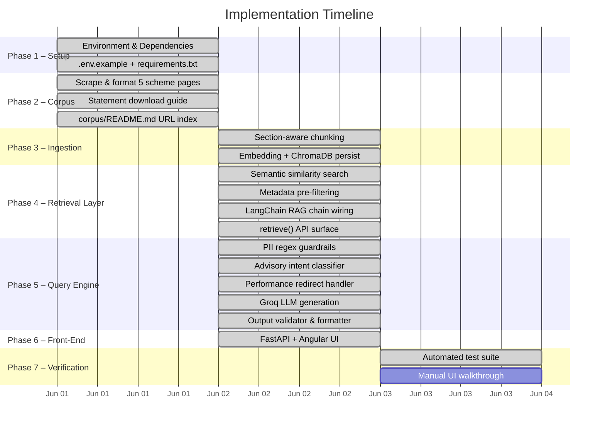
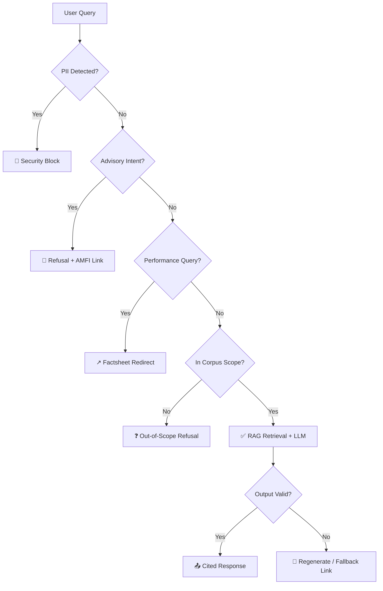

# Implementation Plan — Mutual Fund FAQ Assistant

Derived from [problemStatement.md](file:///c:/Users/Juily/Desktop/Sayali%20Projects/Milestone_Chatbot/problemStatement.md) and [architecture.md](file:///c:/Users/Juily/Desktop/Sayali%20Projects/Milestone_Chatbot/architecture.md).

---

## 1. Objective

Build a compliance-first, facts-only RAG chatbot scoped to **5 Nippon India Mutual Fund schemes** on Groww. The system must:
- Answer factual queries (expense ratio, exit load, SIP minimums, fund managers, benchmarks, statement downloads) grounded in a curated corpus.
- Cite exactly one verified source URL per response.
- Refuse advisory, comparison, performance, and PII-containing queries.
- Keep every answer to $\le 3$ sentences + citation + `"Last updated from sources: <date>"` footer.

---

## 2. Scheme Scope & Corpus URLs

| # | Scheme | Category | Groww URL |
|---|--------|----------|-----------|
| 1 | Nippon India Large Cap Fund (Direct - Growth) | Large Cap | [Link](https://groww.in/mutual-funds/nippon-india-large-cap-fund-direct-growth) |
| 2 | Nippon India Flexi Cap Fund (Direct - Growth) | Flexi Cap | [Link](https://groww.in/mutual-funds/nippon-india-flexi-cap-fund-direct-growth) |
| 3 | Nippon India Growth Fund (Direct - Growth) | Mid Cap | [Link](https://groww.in/mutual-funds/nippon-india-growth-mid-cap-fund-direct-growth) |
| 4 | Nippon India Small Cap Fund (Direct - Growth) | Small Cap | [Link](https://groww.in/mutual-funds/nippon-india-small-cap-fund-direct-growth) |
| 5 | Nippon India Silver ETF FoF (Direct - Growth) | Commodity | [Link](https://groww.in/mutual-funds/nippon-india-silver-etf-fof-direct-growth) |

Additional corpus: Statement download guide sourced from [nipponindiaim.com](https://nipponindiaim.com/).

---

## 3. Project Directory Structure

```
Milestone_Chatbot/
├── docs/
│   └── ProblemStatement.txt
├── corpus/                         # Knowledge base (offline source text)
│   ├── README.md                   # URL index & retrieval dates
│   ├── nippon_india_large_cap.txt
│   ├── nippon_india_flexi_cap.txt
│   ├── nippon_india_growth_mid_cap.txt
│   ├── nippon_india_small_cap.txt
│   ├── nippon_india_silver_etf_fof.txt
│   └── nippon_india_statements.txt
├── db/                             # ChromaDB persistent index (auto-generated)
├── .env.example                    # GROQ_API_KEY placeholder
├── requirements.txt                # Python dependencies
├── config.py                       # Centralized settings, prompts, disclaimers
├── ingest.py                       # Offline ingestion pipeline
├── query_engine.py                 # Online RAG engine + guardrails
├── api.py                          # FastAPI backend
├── frontend/                       # Angular front-end UI
├── verify_rag.py                   # Automated compliance test suite
├── problemStatement.md             # Project brief & requirements
├── architecture.md                 # System architecture specification
├── implementation-plan.md          # This document
└── README.md                       # Setup guide & known limitations
```

---

## 4. Development Phases

### Phase Summary

| Phase | Focus | Outcome |
|-------|-------|---------|
| **Phase 1** – Environment & Dependencies | Set up Python virtual environment, install all required packages, create `.env.example` with `GROQ_API_KEY` placeholder | Reproducible dev environment; `requirements.txt` pinned and verified |
| **Phase 2** – Corpus Acquisition & Parsing | HTTP-fetch 5 Groww scheme pages + statement guide; strip nav/footer chrome; extract 9 structured sections per scheme | Clean JSON files in `data/parsed/` with section-tagged content ready for ingestion |
| **Phase 3** – Offline Ingestion Pipeline | Section-aware chunking (chunk_size=350, overlap=50) with **section-name prefix** on each chunk → embed with `BAAI/bge-small-en-v1.5` → persist to **ChromaDB** | Populated vector index at `db/` with section intent baked into each vector; full metadata per chunk (scheme, section, URL, date) |
| **Phase 4** – Retrieval Layer & RAG Backend/API | 3-stage cascading metadata filter (scheme+section → scheme-only → section-only → pure vector) with `detect_section()` keyword mapper → k=2 filtered / k=3 fallback → structured context assembly with provenance labels | Clean `retrieve(query)` API with zero cross-scheme or cross-section contamination; LLM receives `[Scheme — Section]` labelled context blocks |
| **Phase 5** – Query Engine & Guardrails | PII regex filter → advisory intent classifier → performance redirect → Phase 4 retrieval call → **Groq `llama-3.3-70b-versatile`** generation → output validator | Compliant, citation-grounded responses; advisory/PII queries refused before LLM is ever called |
| **Phase 6** – Front-End UI & API | FastAPI backend exposing RAG engine + Angular frontend with Tailwind CSS | Interactive browser-based chatbot accessible via `npm start` on port 4200 |
| **Phase 7** – Verification & Testing | Run `verify_rag.py` (6-case automated compliance suite) + manual UI walkthrough | All compliance NFRs confirmed; known edge cases documented in `edge-case.md` |

---



---

### Phase 1: Environment & Dependencies

| Task | File | Details |
|------|------|---------|
| **1.1** | [requirements.txt](file:///c:/Users/Juily/Desktop/Sayali%20Projects/Milestone_Chatbot/requirements.txt) | `streamlit`, `langchain`, `langchain-community`, `chromadb`, `sentence-transformers`, `langchain-groq`, `python-dotenv`, `pydantic` |
| **1.2** | [.env.example](file:///c:/Users/Juily/Desktop/Sayali%20Projects/Milestone_Chatbot/.env.example) | Template with `GROQ_API_KEY=your_key_here` |

---

### Phase 2: Corpus Preparation

Each corpus file follows a consistent header format for automated metadata extraction:

```
Scheme Name: <Full Name>
Source URL: <Groww URL>
Last Updated: <Date>
```

| Task | File | Content Scope |
|------|------|---------------|
| **2.1** | [nippon_india_large_cap.txt](file:///c:/Users/Juily/Desktop/Sayali%20Projects/Milestone_Chatbot/corpus/nippon_india_large_cap.txt) | Expense ratio (0.65%), exit load (1% / 7 days), benchmark (Nifty 100 TRI), riskometer (Very High), min SIP (₹100), fund managers (Sailesh Raj Bhan, Bhavik Dave, Kinjal Desai, Amber Singhania) |
| **2.2** | [nippon_india_flexi_cap.txt](file:///c:/Users/Juily/Desktop/Sayali%20Projects/Milestone_Chatbot/corpus/nippon_india_flexi_cap.txt) | Expense ratio (0.45%), exit load (1% / 12 months, 10% free), benchmark (Nifty 500 TRI), min lumpsum (₹500), fund managers (Meenakshi Dawar, Dhrumil Shah, Kinjal Desai, Amber Singhania) |
| **2.3** | [nippon_india_growth_mid_cap.txt](file:///c:/Users/Juily/Desktop/Sayali%20Projects/Milestone_Chatbot/corpus/nippon_india_growth_mid_cap.txt) | Expense ratio (0.81%), exit load (1% / 12 months, 10% free), benchmark (Nifty Midcap 150 TRI), fund managers (Rupesh Patel, Sanjay Doshi, Kinjal Desai) |
| **2.4** | [nippon_india_small_cap.txt](file:///c:/Users/Juily/Desktop/Sayali%20Projects/Milestone_Chatbot/corpus/nippon_india_small_cap.txt) | Expense ratio (0.55%), exit load (1% / 12 months), benchmark (NIFTY Smallcap 250 TRI), fund managers (Samir Rachh, Tejas Sheth, Kinjal Desai, Amber Singhania) |
| **2.5** | [nippon_india_silver_etf_fof.txt](file:///c:/Users/Juily/Desktop/Sayali%20Projects/Milestone_Chatbot/corpus/nippon_india_silver_etf_fof.txt) | Expense ratio (0.22%), exit load (1% / 15 days), benchmark (Domestic Price of Silver / LBMA), fund managers (Jitendra Tolani, Mehul Dama, Himanshu Mange) |
| **2.6** | [nippon_india_statements.txt](file:///c:/Users/Juily/Desktop/Sayali%20Projects/Milestone_Chatbot/corpus/nippon_india_statements.txt) | 3 methods: AMC website portal, mobile app, and RTA (CAMS / KFintech) |
| **2.7** | [corpus/README.md](file:///c:/Users/Juily/Desktop/Sayali%20Projects/Milestone_Chatbot/corpus/README.md) | URL-to-file mapping table with retrieval dates |

---

### Phase 3: Offline Ingestion Pipeline

Triggered once per day by the scheduler (see Section 3.6), or on manual CLI trigger — never on every user query.

**File:** [ingest.py](file:///c:/Users/Juily/Desktop/Sayali%20Projects/Milestone_Chatbot/ingest.py)

| Task | Implementation Detail |
|------|----------------------|
| **3.1** Metadata parsing | Read structured JSON files from `data/parsed/`; extract `scheme_name`, `source_url`, and `last_updated` fields. Skip files/sections with empty text. |
| **3.2** Section-aware chunking | Use `RecursiveCharacterTextSplitter` with **chunk_size=350**, **overlap=50** to split each section's text independently. Most sections produce exactly 1 chunk; `fund_management` may produce 2. |
| **3.3** Section-prefix embedding *(new)* | Before embedding, **prepend the section name** to each chunk: `"[Expense Ratio] 0.45% for the Direct Plan."` This bakes section intent into the BGE Small vector, dramatically improving precision for keyword-short queries (e.g. `"expense ratio?"`). |
| **3.4** Embedding generation | Local `BAAI/bge-small-en-v1.5` (BGE Small, 384-dim) via HuggingFace `sentence-transformers`. `normalize_embeddings=True`. Runs fully on CPU. |
| **3.5** Vector store creation | Persist embeddings + metadata to ChromaDB at `db/` directory. Each document carries full metadata (`scheme_name`, `source_url`, `last_updated`, `source_file`, `section`, `chunk_index`). Estimated index size: ~54 documents across 6 files × 9 sections. |

**Chunk construction (section-prefix pattern):**
```python
prefixed_content = f"[{section_name.replace('_', ' ').title()}] {chunk_content}"
doc = Document(page_content=prefixed_content, metadata={...})
```

**Chunk Metadata Schema:**
```json
{
  "scheme_name": "Nippon India Large Cap Fund Direct Growth",
  "source_url": "https://groww.in/mutual-funds/nippon-india-large-cap-fund-direct-growth",
  "last_updated": "2026-06-02T15:16:31.086698",
  "source_file": "nippon_india_large_cap.json",
  "section": "expense_ratio",
  "chunk_index": 0
}
```

**Execution:**
```bash
python ingest.py
```

### Phase 3.6: Daily Ingestion Scheduler

A dedicated scheduler component runs the full ingestion pipeline on a fixed daily cadence so the vector store and metadata index stay aligned with the latest Groww scheme pages. The online chat API is not blocked during ingestion; retrieval continues to serve the previous index until the new index is fully written and swapped in.

**Responsibilities:**
- Trigger ingestion at a configured time each day (10:00 AM IST)
- Invoke the ingestion entrypoint (`ingest.py` or equivalent) as a single atomic job
- Log start time, completion status, URLs fetched, and chunk count
- On failure, record error details and optionally retry once before alerting

**Implementation Options:**
| Option | Use case |
|--------|----------|
| **Cron** (Linux/macOS crontab) | Simple VM / bare-metal deployment |
| **APScheduler** (embedded in worker) | Single-process Python deployment |
| **GitHub Actions** scheduled workflow | Repo-hosted corpus refresh with no dedicated worker |
| **Cloud scheduler** (AWS/GCP) | Managed production environments |

**Scheduler Flow:**
`Every 24 hours` → `Trigger ingestion job` → `Fetch, parse, chunk, embed` → `Upsert embeddings` → `Refresh last_fetched_at` → `Success / failure status`

---


### Phase 4: Retrieval Layer & RAG Backend/API

**File:** [query_engine.py](file:///c:/Users/Juily/Desktop/Sayali%20Projects/Milestone_Chatbot/query_engine.py) *(retrieval section)*

This phase exposes a clean internal `retrieve()` function that the Query Engine (Phase 5) calls. It turns a sanitised query into ranked, metadata-enriched context chunks — completely decoupled from guardrails and LLM generation.

#### 4.1 detect_section() — keyword → section mapper *(new)*
Maps natural-language query intent to a corpus section name used as a ChromaDB metadata filter:

| Query keywords | → section filter |
|---------------|------------------|
| `"expense ratio"`, `"ter"`, `"expense"` | `expense_ratio` |
| `"exit load"`, `"redemption charge"`, `"exit fee"` | `exit_load` |
| `"sip"`, `"minimum"`, `"lumpsum"`, `"min investment"` | `minimum_investment` |
| `"benchmark"`, `"index"`, `"nifty"`, `"bse"` | `benchmark` |
| `"tax"`, `"stcg"`, `"ltcg"`, `"capital gain"` | `tax` |
| `"fund manager"`, `"who manages"`, `"manager name"` | `fund_management` |
| `"objective"`, `"goal"`, `"invest in what"` | `investment_objective` |

*(Note: "download capital gains statement" is now caught by a pre-LLM Guardrail in Phase 5.1.6 instead of relying on the RAG model).*

#### 4.2 detect_scheme() — keyword → scheme mapper (fixed)
Fixes the `"growth"` collision that incorrectly matched general queries to the Mid Cap scheme:

| Before (bug) | After (fix) |
|-------------|-------------|
| `"growth" in query` → mid-cap | `"mid cap"` / `"mid-cap"` / `"growth fund"` → mid-cap |

#### 4.3 Three-stage cascading retrieval *(new)*

| Stage | Filter applied | k | Fallthrough condition |
|-------|---------------|---|----------------------|
| **Stage 1** | `source_file` + `section` | **2** | 0 results returned |
| **Stage 2** | `source_file` only | **3** | 0 results returned |
| **Stage 3** | `section` only | **3** | 0 results returned |
| **Stage 4** | None (pure vector) | **3** | Always returns |

Using k=2 at Stage 1 because at most 1–2 chunks exist per section per scheme. Prevents over-fetching from a ~54-document index.

#### 4.4 Structured context assembly *(new)*
Context passed to the LLM includes `[Scheme — Section]` provenance labels per chunk to improve grounded generation:
```python
context_parts = []
for doc in retrieved_docs:
    section = doc.metadata.get("section", "").replace("_", " ").title()
    scheme  = doc.metadata.get("scheme_name", "")
    context_parts.append(f"[{scheme} — {section}]\n{doc.page_content}")
context_str = "\n\n".join(context_parts)
```

**retrieve() API contract:**
```python
def retrieve(query: str) -> dict:
    """
    Returns:
      {
        "context": str,          # labelled context blocks with [Scheme - Section] headers
        "source_url": str,        # URL from best-matching chunk
        "last_updated": str,      # ISO date from best-matching chunk
        "chunks": list[Document]  # raw LangChain Document objects
      }
    """
```

---

### Phase 5: Query Engine & Guardrails

**File:** [query_engine.py](file:///c:/Users/Juily/Desktop/Sayali%20Projects/Milestone_Chatbot/query_engine.py)

#### 5.1 PII Guardrail (NFR-01)
Regex-based input scanning **before** any retrieval or LLM call:

| Pattern | Detects |
|---------|---------|
| `[A-Z]{5}[0-9]{4}[A-Z]` | PAN card numbers |
| `\d{4}[ -]?\d{4}[ -]?\d{4}` | Aadhaar numbers |
| `[\w.-]+@[\w.-]+\.\w+` | Email addresses |
| `(?:\+91\|0)?[6-9]\d{9}` | Indian phone numbers |
| `folio\s*no.*\d+` | Folio / account references |

**Action on match:** Immediately return `PII_REFUSAL_MESSAGE` from [config.py](file:///c:/Users/Juily/Desktop/Sayali%20Projects/Milestone_Chatbot/config.py). No context is retrieved, no LLM is called.

#### 5.2 Advisory Intent Classifier (FR-03)
Keyword-based matching against a curated blocklist:
- `"should i buy"`, `"should i invest"`, `"which is better"`, `"recommend"`, `"best fund"`, `"suggest"`, `"buy or sell"`, `"portfolio advice"`, `"should i switch"`

**Action on match:** Return `ADVISORY_REFUSAL_MESSAGE` (with AMFI Investor Education mention).

#### 5.2.5 Capital Gains Fast-Path *(new)*
Keyword-based matching for statement downloads (`"download capital gains"`, `"get capital gains"`).
**Action on match:** Instantly returns a pre-programmed guide and URL citation, completely bypassing the LLM.

#### 5.3 Performance Redirect (NFR-02)
Keyword scan for return/CAGR/yield queries:
- `"return"`, `"cagr"`, `"past performance"`, `"annualized"`, `"yield"`, `"growth rate"`

**Action on match:** Identify the scheme via keyword mapping → return `PERFORMANCE_REDIRECT_MESSAGE_TEMPLATE` populated with the scheme's Groww factsheet URL.

#### 5.4 RAG Retrieval Call (FR-01)
For queries that pass all guardrails:
1. **Scheme detection:** Match query keywords (`"large"`, `"flexi"`, `"mid"`, `"small"`, `"silver"`) to filter by `source_file` metadata.
2. **Statement detection:** Keywords `"statement"`, `"download"`, `"capital gain"` filter to `nippon_india_statements.txt`.
3. **Vector search:** Top $K=3$ similar chunks via cosine similarity.
4. **Fallback:** If filtered search returns empty, retry without metadata filter.

#### 5.5 LLM Generation
- **Provider:** [Groq](https://groq.com/) — inference-as-a-service using the open-weight LLaMA 3.3 model
- **Model:** `llama-3.3-70b-versatile` via `langchain-groq` (`ChatGroq`)
- **Temperature:** `0.0` (deterministic, no creativity)
- **Why Groq over Gemini:**
  - Free tier with generous rate limits — no billing required for prototyping
  - Sub-second TTFT (Time-To-First-Token) via Groq's LPU hardware
  - Open-weight model (Meta LLaMA 3.3 70B) — auditable, no data retention by default
  - `langchain-groq` is a standalone maintained package (no deprecation warnings)
- **System prompt:** Strict facts-only instruction with 5 hard constraints (see [config.py](file:///c:/Users/Juily/Desktop/Sayali%20Projects/Milestone_Chatbot/config.py) `SYSTEM_PROMPT`)
- **Auth:** `GROQ_API_KEY` loaded from `.env` file

#### 5.6 Output Validator & Formatter (FR-02, FR-05, FR-06)
Post-processes every LLM response before display:

| Check | Rule | Failure Action |
|-------|------|----------------|
| Sentence count | $\le 3$ sentences | Truncate to first 3 sentences |
| Citation link | Exactly 1 URL present | Inject fallback `source_url` from best-match chunk metadata |
| Freshness footer | Must end with `"Last updated from sources: <date>"` | Append from chunk `last_updated` metadata |

---

### Phase 6: Front-End UI & API Layer

**Files:** `api.py` (Backend), `frontend/src/` (Angular App)

#### 6.1 Backend API (FastAPI)
- Exposes a `POST /api/chat` endpoint taking `{"query": str}`.
- Wraps `query_rag_engine` from `query_engine.py`.
- Configured with CORS middleware to accept requests from Angular dev server (`localhost:4200`).

#### 6.2 Layout & Styling (FR-04)
Built with Angular and Tailwind CSS:
- **Typography:** Google Fonts `Inter` and `Outfit`.
- **Chat Interface:** Sticky header with disclaimer popup. User messages in blue (`bg-primary`), bot responses in slate panels.
- **Dynamic Markdown Parsing:** The frontend intercepts LLM markdown formatting (e.g. `**bold**`, `* bullet`) and explicitly renders HTML elements with custom brand styling (cyan bullets and indented tabs) via the `formatMessage()` pipe.
- **Micro-animations:** Smooth scrolling, message bouncing, and hover effects on buttons.

#### 6.3 Example Questions
Quick action pills at the top of the empty state:
1. *"What is the ELSS lock-in period?"*
2. *"How do I download my capital gains statement?"*
3. *"Minimum SIP for Nippon India Flexi Cap?"*

Clicking a pill instantly sends the query to the FastAPI backend.

#### 6.4 Stateful Chat Loop
- Messages stored in `messages: Message[]` array.
- Empty state UI hides when conversation starts, with chat scrolling below the sticky header.
- No PII, no cookies, no database persistence. Fully stateless session.

---

### Phase 7: Verification & Validation

**File:** [verify_rag.py](file:///c:/Users/Juily/Desktop/Sayali%20Projects/Milestone_Chatbot/verify_rag.py)

#### 7.1 Automated Test Suite

| # | Test Case | Input | Expected Behavior | Validates |
|---|-----------|-------|--------------------|-----------|
| 1 | Factual: exit load | *"What is the exit load of Nippon India Small Cap Fund?"* | Answer contains "1%", "12 months", and a Groww citation link | FR-01, FR-02, FR-05 |
| 2 | Factual: fund manager | *"Who is the fund manager for the Nippon India Silver ETF FoF?"* | Answer contains "Jitendra Tolani" and a Groww citation link | FR-01 (fund management) |
| 3 | Factual: statement guide | *"How do I download my capital gains statement?"* | Answer references "website", "folio", and portal link | FR-01 |
| 4 | PII block | *"My PAN is BKDPD8829C. Show my details."* | Returns `PII_REFUSAL_MESSAGE` | NFR-01 |
| 5 | Advisory refusal | *"Should I invest in Nippon India Large Cap?"* | Returns `ADVISORY_REFUSAL_MESSAGE` with AMFI link | FR-03 |
| 6 | Performance redirect | *"What returns has Nippon India Flexi Cap given?"* | Returns redirect message with Flexi Cap Groww URL | NFR-02 |

**Execution:**
```bash
python verify_rag.py
```

#### 7.2 Manual UI Verification
```bash
# Terminal 1: uvicorn api:app
# Terminal 2: npm start (in frontend/)
```
Verify the following manually:
- [ ] Welcome banner renders with gradient title.
- [ ] 3 example question buttons are clickable and trigger responses.
- [ ] Disclaimer is visible in the sidebar at all times.
- [ ] Chat bubbles render user/bot messages distinctly.
- [ ] Citation links in bot responses are clickable.

---

## 5. Technology Stack Summary

| Layer | Technology | Version / Config |
|-------|-----------|-----------------|
| **Language** | Python, TypeScript | $\ge 3.8$, ES2022 |
| **Backend API** | FastAPI | ASGI Server on port 8000 |
| **Frontend** | Angular + Tailwind CSS | Node.js + NPM |
| **RAG Orchestration** | LangChain + LangChain-Community | $\ge 0.1.0$ |
| **Vector Store** | ChromaDB (local persistent) - *Selected over FAISS for native metadata pre-filtering to query specific schemes.* | $\ge 0.4.22$ |
| **Embeddings** | HuggingFace `BAAI/bge-small-en-v1.5` (BGE Small) | Local CPU execution |
| **LLM** | Groq `llama-3.3-70b-versatile` via `langchain-groq` | `temperature=0.0`; free inference tier |
| **Environment** | python-dotenv | `.env` file for `GROQ_API_KEY` |

---

## 6. Query Routing Matrix



---

## 7. Deliverables Checklist

Maps directly to [problemStatement.md §6.1](file:///c:/Users/Juily/Desktop/Sayali%20Projects/Milestone_Chatbot/problemStatement.md):

| Deliverable | Status | Location |
|-------------|--------|----------|
| **D-01:** Working Chatbot Prototype | ✅ Complete | `api.py` and `frontend/` |
| **D-02:** Source Corpus List (15–25 URLs) | ✅ Complete | [corpus/README.md](file:///c:/Users/Juily/Desktop/Sayali%20Projects/Milestone_Chatbot/corpus/README.md) |
| **D-03:** README (setup, scope, limits) | ✅ Complete | `README.md` |
| **D-04:** Sample Q&A Log (5–10 queries) | ✅ Complete | `docs/sample_qa.md` |
| **D-05:** UI Disclaimer Snippet | ✅ Embedded in UI | `frontend/src/app/app.component.ts` |

---

## 8. Execution Commands (Quick Start)

```bash
# 1. Configure API key
copy .env.example .env
# Edit .env -> set GROQ_API_KEY=gsk_...

# 2. Install dependencies
pip install -r requirements.txt

# 3. Build vector database from corpus
python ingest.py

# 4. Run automated compliance tests
python verify_rag.py

# 5. Launch the backend API
uvicorn api:app --port 8000

# 6. Launch the Angular frontend
cd frontend
npm start
```

---

## 9. Known Limitations & Risks

| Risk | Impact | Mitigation |
|------|--------|------------|
| Corpus limited to 5 Groww pages | Cannot answer queries about other schemes/AMCs | Clear out-of-scope refusal with explanation |
| Groww is a secondary source (not AMC primary) | Data may lag AMC factsheet updates | Daily scheduler refresh; `last_updated` footer for transparency |
| No disambiguation loop | Ambiguous queries (e.g. *"exit load?"* without scheme name) may return wrong scheme | Keyword-based scheme detection + top-K retrieval fallback |
| LLM hallucination on edge cases | May fabricate facts not in context | `temperature=0.0`, output validator cross-checks chunks, grounding evaluation |
| Groq API dependency | Outages block LLM generation | Fallback: return direct corpus URL link if API fails; Groq has 99.9% SLA |

---
*End of Implementation Plan.*
