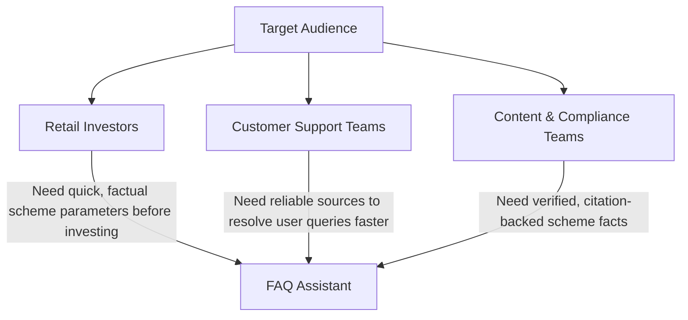

# Groww Genie — Facts-Only Q&A Chatbot
## Engineering Problem Statement & Project Brief (Aligned with Groww Genie Specification)

---

### Project Metadata
* **Document Type:** Project Context & Problem Statement
* **Reference Product Context:** Groww Genie (Factual, compliance-first user assistance)
* **Target Release:** June 2026
* **Version:** 1.0

---

## 1. Executive Summary & Overview

This project focuses on the design and implementation of a lightweight, Retrieval-Augmented Generation (RAG)-based Q&A chatbot called **Groww Genie** that answers factual, objective queries about mutual fund schemes in India. 

> [!IMPORTANT]  
> **Core Mandate:** The system must operate exclusively on verified, official public sources (e.g., AMC websites, AMFI portals, and SEBI disclosures). It is strictly prohibited from generating, implying, or computing any investment advice, return projections, or portfolio comparison/recommendations.

Every answer generated by Groww Genie must include exactly **one verifiable citation link** pointing to the source document, ensuring complete transparency and compliance.

---

## 2. Problem Context

In the Indian retail investment landscape, investors and customer support teams frequently spend significant time searching for basic, objective mutual fund facts. Details like expense ratios, exit loads, lock-in periods, risk classifications, and statement download processes are often scattered across multiple PDF documents (factsheets, KIMs, SIDs) or various subpages of AMC websites.

This leads to:
* **Operational Inefficiencies:** Customer support teams wasting time addressing repetitive, factual queries.
* **Information Discrepancies:** Risk of investors receiving outdated or incorrect information from unofficial third-party blogs.

### Target Audience


---

## 3. Project Scope

### 3.1. AMC & Scheme Selection
The FAQ assistant is scoped to **Nippon India Mutual Fund** (AMC). The following **5 schemes** under this AMC have been selected to populate the knowledge base:

1. **Large-Cap Fund:**
   * Scheme: [Nippon India Large Cap Fund (Direct - Growth)](https://groww.in/mutual-funds/nippon-india-large-cap-fund-direct-growth)
2. **Flexi-Cap Fund:**
   * Scheme: [Nippon India Flexi Cap Fund (Direct - Growth)](https://groww.in/mutual-funds/nippon-india-flexi-cap-fund-direct-growth)
3. **Mid-Cap Fund:**
   * Scheme: [Nippon India Growth Fund (Mid Cap) (Direct - Growth)](https://groww.in/mutual-funds/nippon-india-growth-mid-cap-fund-direct-growth)
4. **Small-Cap Fund:**
   * Scheme: [Nippon India Small Cap Fund (Direct - Growth)](https://groww.in/mutual-funds/nippon-india-small-cap-fund-direct-growth)
5. **Silver ETF FoF (Commodity / Alternative):**
   * Scheme: [Nippon India Silver ETF FoF (Direct - Growth)](https://groww.in/mutual-funds/nippon-india-silver-etf-fof-direct-growth)

### 3.2. Corpus Collection & Verified Source URLs
A highly curated corpus of **25 official public pages/documents** is compiled:

| Category | Count | Source Types |
| :--- | :--- | :--- |
| **A — Groww scheme pages (official distributor)** | 5 | Direct Scheme details: NAV, AUM, Exit load, Expense ratio |
| **B — AMC scheme pages (nipponindiaim.com)** | 5 | Portfolio holdings, Fund manager details, NAV, performance disclosures |
| **C — AMC factsheets & product notes (PDF)** | 5 | Key metrics, Benchmark details (Nifty 100 TRI, Nifty 500 TRI), Riskometer classifications |
| **D — SID / KIM documents (PDF)** | 3 | Scheme Information Documents, exit load limits |
| **E — Statement & tax guides** | 3 | Step-by-step guides for statement downloads from CAMS/KFintech/Groww |
| **F — AMFI / SEBI regulatory pages** | 4 | Regulatory frameworks, TER limits, and SEBI Riskometer explanations |

For the full detailed list of all 25 source URLs and metadata, refer to [groww-genie-source-list.md](file:///c:/Users/Juily/Desktop/Sayali%20Projects/Milestone_Chatbot/docs/groww-genie-source-list.md).

| Permitted Sources (Official Only) | Prohibited Sources |
| :--- | :--- |
| AMC official websites (Factsheets, KIM, SID, Fee & Charge pages) | ❌ Third-party financial blogs or forums |
| SEBI regulatory filings & scheme disclosures | ❌ Mutual fund aggregator websites |
| AMFI riskometer/benchmark guidelines & standard FAQs | ❌ Screenshots of backend application interfaces |
| Official statement & tax-doc download guides | ❌ Paywalled or login-restricted pages |

---

## 4. System Requirements

### 4.1. Functional Requirements

* **FR-01: Factual Query Resolution**  
  The assistant must resolve objective queries only. Supported categories include:
  * Expense ratio of a specific scheme
  * Exit load structure (percentage and period)
  * Minimum SIP / lump-sum investment amounts
  * ELSS lock-in periods (e.g., 3 years)
  * Riskometer category (e.g., Very High, Moderate) and benchmark index
  * Fund management details (fund manager names, experience, and tenure)
  * Clear guides/links for downloading capital-gains or account statements

* **FR-02: Strict Single Citation**  
  Every response must include exactly one citation link pointing to the source URL in the corpus.

* **FR-03: Advisory & Opinion Refusal**  
  The system must detect and gracefully refuse subjective/advisory queries (e.g., *"Should I invest in this fund?"*, *"Which fund is better?"*).
  * **Refusal Action:** Provide a polite, facts-only disclaimer stating that the system cannot provide investment advice, and link the user to an official educational resource (e.g., AMFI Investor Education).

* **FR-04: User Interface Basics**  
  The UI must be clean and minimal, displaying:
  1. A welcoming intro message.
  2. Three pre-loaded example questions to guide the user.
  3. A persistent disclaimer: **"Facts-only. No investment advice."**

* **FR-05: Concise Responses**  
  All answers must be short and direct, limited to **a maximum of 3 sentences**.

* **FR-06: Data Freshness Label**  
  Every response must include the footer: `"Last updated from sources: <Date>"` to indicate data freshness.

---

### 4.2. Non-Functional Requirements & Safety Guardrails

> [!WARNING]  
> **NFR-01: PII Protection (Zero-Trust Data Policy)**  
> Under no circumstances should the system accept, process, store, or log Personally Identifiable Information (PII). Groww Genie must refuse inputs containing:
> * PAN or Aadhaar numbers
> * Bank account/folio numbers
> * OTPs, passwords, or security keys
> * Email addresses and phone numbers

> [!CAUTION]  
> **NFR-02: Return & Performance Calculations**  
> The system must **never compute, project, or compare returns**. For performance queries, Groww Genie must refrain from writing percentages or calculation text and instead provide a direct link to the official AMC factsheet.

* **NFR-03: Portability & Hosting**  
  The prototype must be lightweight, designed to deploy seamlessly as a hosted web application (e.g., Vercel, Streamlit) or run within a Jupyter/Colab notebook.

---

## 5. Technical Constraints

* **Strict Guardrails:** Implementation of safety filters/guardrails to prevent LLM hallucinations on unsupported or out-of-domain queries.
* **Citation Integrity:** The citation link must map directly to the actual document/page stored in the corpus (no dynamic browsing of unverified web results).
* **Factual Refusals:** Advisory and out-of-domain inputs must trigger predefined template responses rather than dynamic conversational advice.

---

## 6. Deliverables & Success Criteria

### 6.1. Expected Deliverables

```
├── D-01: Working Chatbot Prototype (Hosted Web App or Colab Notebook)
├── D-02: Source Corpus List (CSV/MD format with 15–25 verified URLs)
├── D-03: Project README (Setup steps, selected schemes, RAG architecture, limits)
├── D-04: Sample Q&A Log (5–10 representative test queries with responses & links)
└── D-05: UI Disclaimer Snippet ("Facts-only. No investment advice.")
```

### 6.2. Success Criteria
1. **Precision Over Cleverness:** Accurate retrieval of factual details (e.g., matching the exact expense ratio from the factsheet).
2. **Citation Accuracy:** $100\%$ validation rate for citation links matching the answer content.
3. **Robust Safety Filters:** Complete prevention of investment recommendations, return calculations, and PII ingestion.
4. **Clean UX:** A user-friendly interface that aligns with the visual minimalism expected of modern financial tools.

---

## 7. Out of Scope

To prevent scope creep, the following features are explicitly **excluded**:
* Live portfolio synchronization or folio tracking.
* Dynamic computation of returns or benchmark outperformance.
* Interactive advisory features (e.g., risk-profiling tools, asset allocation suggestions).
* User authentication, user-specific accounts, or data storage.
* Real-time NAV API integrations (data will remain static based on the collected corpus update date).

---
*End of Problem Statement. Formatted for the Milestone Chatbot Development Workspace.*
